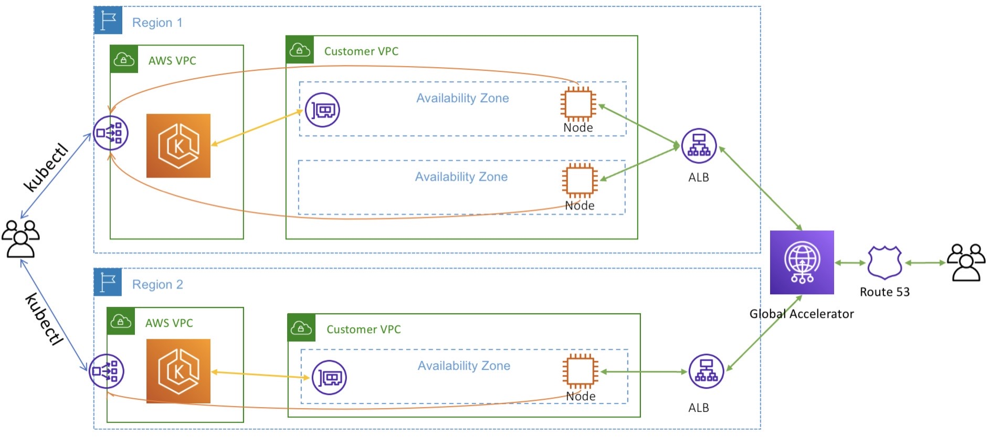

## Terraform Infrastructure as Code (IaC) Repository
# Overview
This repository manages the infrastructure for multiple environments (dev, qa, prod, shared-services) using Terraform. It is organized to facilitate modular and reusable infrastructure components.

## Architecture
This terraform represents a multi environment and region EKS deployment. Ideally, this is changed slightly as to deploy a hub/spoke model of clusters across regions and environments. In this scenario, there would be a "hub" cluster in the shared-services region, that would be responsible for deploying apps across clusters using argoCD.

Ideally, apps are served from multiple regions and geo-routing applied via a cloudfront distribution or global accelator.

# Scaling
These clusters are built with karpenter auto-scaling in mind. The clusters are built initially with fargate nodes simply to get the karpenter workload running. From there, karpenter will be responsible for responding to scheduling events and will dynamically scale the cluster in the most cost efficient way; using a the AWS Pricing API to optimize compute costs. It is also capable of deploying workloads safely into spot instance nodes by utilizing interuption handling.

## Structure
This repository is organized by provider/environment/region

## Workflow Integration
# Pull Request Workflow: 
This workflow detects changes in specific paths related to the environment and executes terraform plan accordingly. It ensures that changes are evaluated before being applied, providing visibility and reducing the risk of errors.
# Merge Workflow: 
Upon merging, this workflow runs terraform plan and terraform apply to enact the proposed changes. It enables efficient and consistent updates across all defined environments and regions.